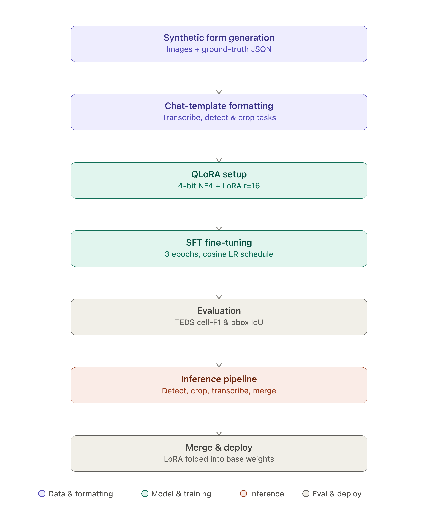

# Pipeline description
This project is a fine-tuning implementation of Qwen3-VL to read scanned health forms and output a single JSON object 
containing form metadata plus a table_html field with the transcribed table.

## Pipeline
Synthetic form images with ground-truth JSON are generated, then formatted into 3-turn chat examples 
(system/user/assistant) across three task types: 
- full transcription
- table-region detection (bounding boxes on a normalized 0–1000 grid)
- cropped-table transcription

A custom collator renders each example, masks everything except the assistant's target tokens so loss only trains 
the desired output. Then, the base model is loaded in 4-bit NF4 (QLoRA) with gradient checkpointing, since a full bf16 
fine-tune would require massive computation resources. LoRA adapters target only the language-model's attention/MLP 
projections (q/k/v/o_proj, gate/up/down_proj), leaving the vision tower frozen (the task is teaching output format and
scanning guidelines, preserving perception). 

## Settings
An initial LoRA config is proposed for this pipeline, but hyperparameter search is recommended:
- r=16: default is 8, increased since a rigid new grammar needs it
- alpha=32: used a 2*r scaling heuristic
- dropout=0.05: a generally good initial regularization value
- bias="none": the standard choice
- task_type="CAUSAL_LM": Qwen3-VL's language modeling head

Training runs via SFTTrainer (85/15 split, 3 epochs, cosine LR). Evaluation uses a TEDS-style cell-level F1 score on 
parsed HTML tables plus bounding-box IoU for detection. Inference chains `detect → crop → transcribe → merge`, with 
row-band tiling and overlap deduplication for tables too large for one crop.

## Design logic
HTML's rowspan/colspan encodes merged cells, and it's already well-represented in pretraining data, 
so the model reuses known syntax instead of learning one from scratch. Detect-then-crop helps in keeping a high
resolution for the transcription process.

> Diagram courtesy of Sonnet 5